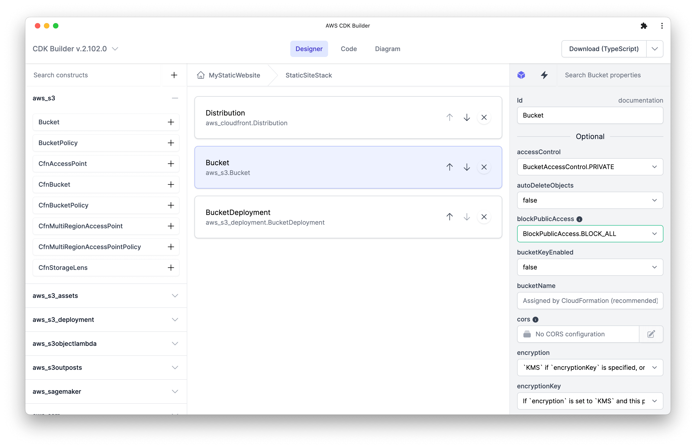
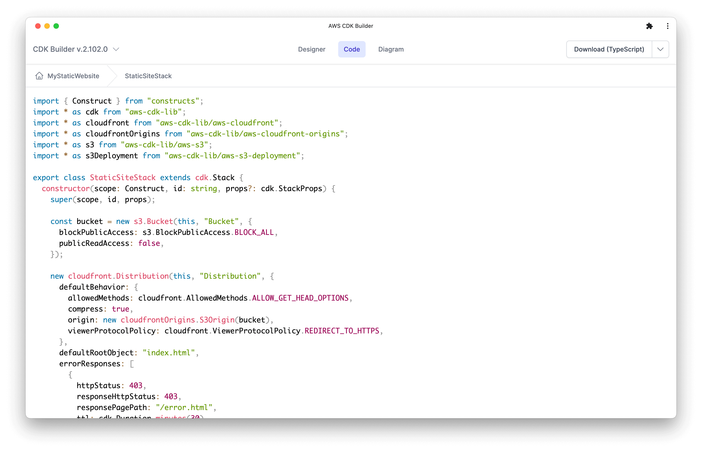
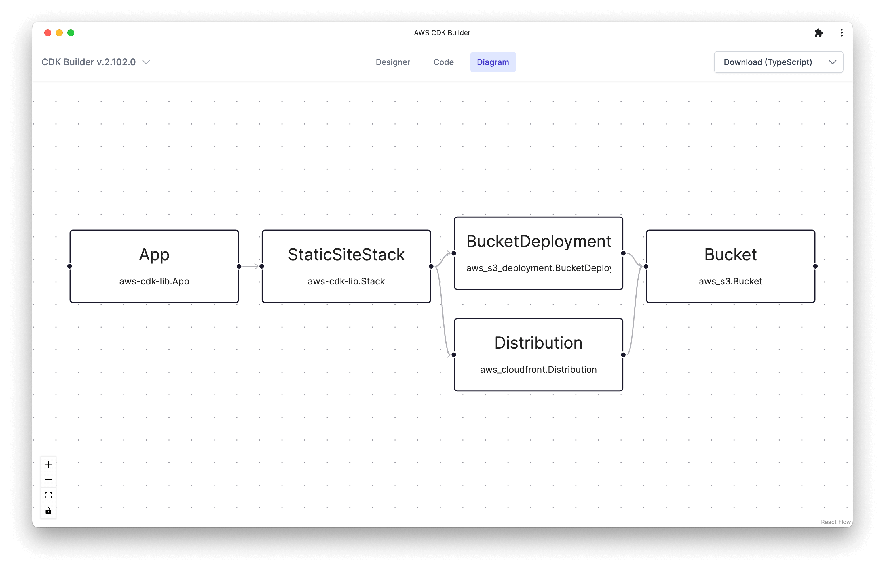
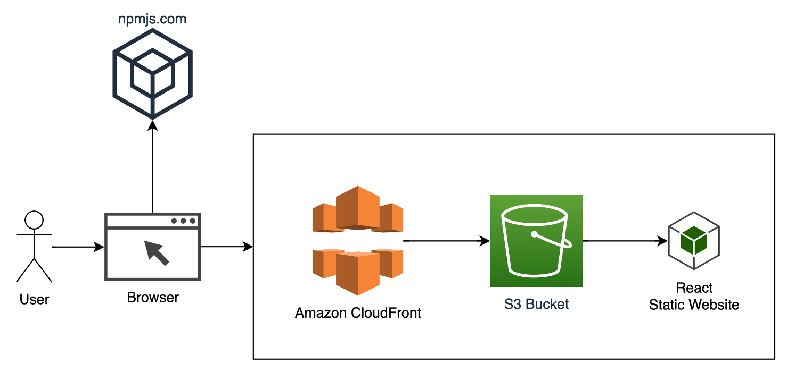

# AWS CDK Builder
[](https://github.com/aws-samples/aws-cdk-stack-builder-tool/releases)
[](https://opensource.org/licenses/MIT)

**:fire: [Try AWS CDK Builder](https://aws-samples.github.io/aws-cdk-stack-builder-tool/) :fire:**



## Table of content
- [Features](#features)
- [Deploy](#deploy)
  - [With AWS Cloud9](#deploy-with-aws-cloud9)
  - [Local deployment](#local-deployment)
- [Clean up](#clean-up)
- [Architecture](#architecture)
- [Adding private constructs](#adding-private-constructs)
- [License](#license)

# Features

AWS CDK Builder is a browser-based tool designed to streamline bootstrapping of Infrastructure as Code (IaC) projects using the AWS Cloud Development Kit (CDK). Equipped with a dynamic visual designer and instant TypeScript code generation capabilities, the CDK Builder simplifies the construction and deployment of CDK projects. It stands as a resource for all CDK users, providing a platform to explore a broad array of CDK constructs.




# Deploy

You do not need to deploy the AWS CDK Builder to use it; an online version is available.

https://aws-samples.github.io/aws-cdk-stack-builder-tool

But if you wish to deploy it on your own account, here is a step-by-step guide.

### Environment setup

#### Deploy with AWS Cloud9
We recommend deploying with [AWS Cloud9](https://aws.amazon.com/cloud9/).
If you'd like to use Cloud9 to deploy the solution, you will need the following before proceeding:
- use `Amazon Linux 2023` as the platform.

#### Local deployment
If you have decided not to use AWS Cloud9, verify that your environment satisfies the following prerequisites:

You have:

1. An [AWS account](https://aws.amazon.com/premiumsupport/knowledge-center/create-and-activate-aws-account/)
2. `AdministratorAccess` policy granted to your AWS account (for production, we recommend restricting access as needed)
3. Both console and programmatic access
4. [NodeJS 18](https://nodejs.org/en/download/) installed
    - If you are using [`nvm`](https://github.com/nvm-sh/nvm) you can run the following before proceeding
    - ```
      nvm install 18 && nvm use 18
      ```
5. [AWS CLI](https://aws.amazon.com/cli/) installed and configured to use with your AWS account
6. [Typescript 3.8+](https://www.typescriptlang.org/download) installed
7. [AWS CDK CLI](https://docs.aws.amazon.com/cdk/latest/guide/getting_started.html) installed
8. [Docker](https://docs.docker.com/get-docker/) installed
9. [Python 3+](https://www.python.org/downloads/) installed

### Deployment

1. Clone the repository
```bash
git clone https://github.com/aws-samples/aws-cdk-stack-builder-tool
```
2. Move into the cloned repository
```bash
cd aws-cdk-stack-builder-tool
```

<a id="deployment-dependencies-installation"></a>
3. Install the project dependencies by running this command
```bash
npm install
```

4. (Optional) Bootstrap AWS CDK on the target account and region

> **Note**: This is required if you have never used AWS CDK on this account and region combination. ([More information on CDK bootstrapping](https://docs.aws.amazon.com/cdk/latest/guide/cli.html#cli-bootstrap)).

```bash
npx cdk bootstrap aws://{targetAccountId}/{targetRegion}
```

You can now deploy by running:

```bash
npx cdk deploy
```

You can view the progress of your CDK deployment in the [CloudFormation console](https://console.aws.amazon.com/cloudformation/home) in the selected region.

5. Once deployed, take note of the `DomainName`

```bash
...
Outputs:
cdk-builder.DomainName = https://dxxxxxxxxxxxxx.cloudfront.net
...
```

6. Open the `DomainName` Url for the outputs above, i.e. `https://dxxxxxxxxxxxxx.cloudfront.net`


# Clean up
You can remove the stacks and all the associated resources created in your AWS account by running the following command:

```bash
npx cdk destroy
```

# Architecture
AWS CDK Builder is a serverless static website application, created using React and TypeScript.



# Adding private constructs
If there are constructs which are not in the public npm js registry, they can be added as follows:

1. Download the npm package:
```bash
npm pack <your-package> --pack-destination ./src/react-app/public/constructs
```

2. Modify a blueprint to use the newly added package. For example, to change the `Blank` blueprint:
```bash
open ./src/react-app/src/blueprints/cdk-blank.ts
```

3. Modify `libs: {` as follows:
```typescript
libs: {
  "@aws-cdk/aws-amplify-alpha": "2.x",
  ...
  "@aws-cdk/region-info": "2.x",
  "my-cool-lib-1.2.3.tgz": "local" // <-- This is the line to add, use filename as found in ./src/react-app/src/public/constructs as the key, and "local" as the value
},

```

Now when a project is created using the modified blueprint, it will have access to the private constructs.

# License

This library is licensed under the MIT-0 License. See the LICENSE file.

- [Changelog](CHANGELOG.md) of the project.
- [License](LICENSE) of the project.
- [Code of Conduct](CODE_OF_CONDUCT.md) of the project.
- [CONTRIBUTING](CONTRIBUTING.md#security-issue-notifications) for more information.
